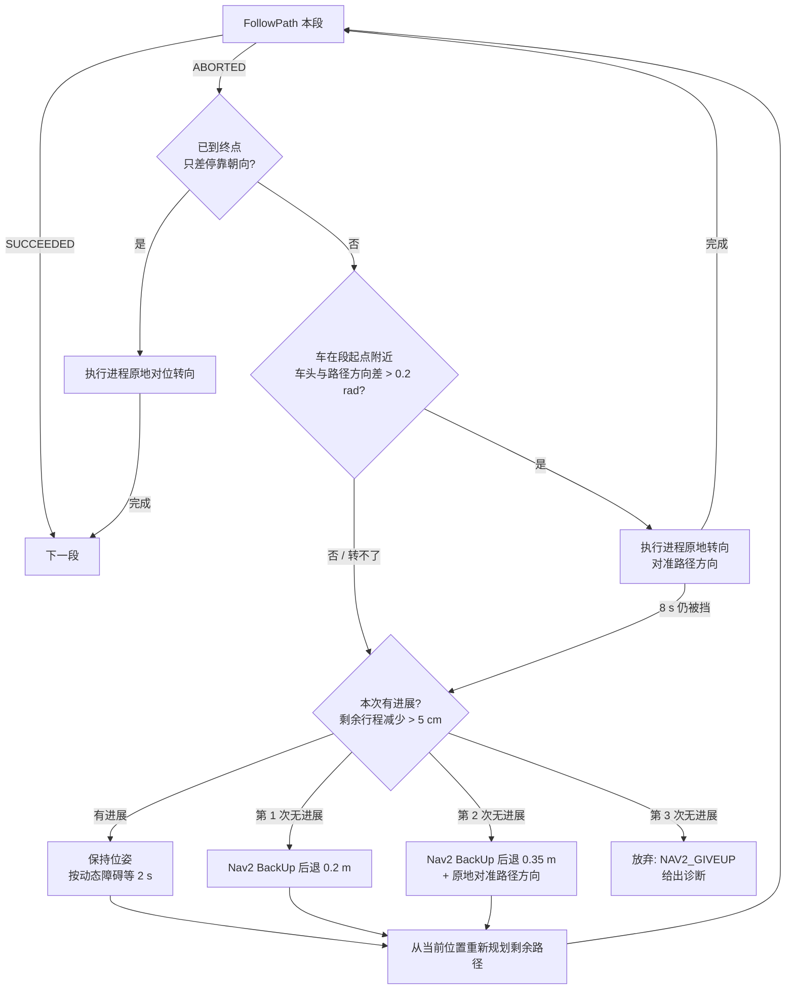

# 导航说明：两种规划器、Nav2 线路跟随中断与恢复

适用版本：2026-09-28 起 (提交 `d3d86aa` 之后)。相关代码：`nav_runtime/navigator.py`、`nav2_bridge.py`、`tools/gen_nav2_params.py`、`nav2/loc_launch.py`。

## 1. 两种规划器：执行进程规划器与 Nav2

工作台里的"执行进程规划器 → dijkstra / nav2"切换的是**谁来把车开过去**。两者**用同一条路线**，区别在于路线交给谁去执行：

| | 执行进程规划器 (dijkstra，另有 astar / direct) | Nav2 |
|---|---|---|
| 路线 | 场景拓扑路网上的 Dijkstra 最短路 (工位、节点、拐点、圆弧过弯) | **同一条拓扑路线**，转成间距 5 cm 的稠密路径，在停车转向的拐点处分段 |
| 谁控制车 | 执行进程自己的导引循环 (Python，约 30 Hz)：Stanley 式横向纠偏；先停车、再原地转向；按 √(2·a·s) 规划减速，精确停到拐点和工位；末端对正 | ROS 2 Nav2 `controller_server`：每段发一次 FollowPath，由 RotationShim 先把车头转向路径方向，再交给 Regulated Pure Pursuit (RPP) 跟线 |
| 障碍/碰撞判定 | 用实测激光点：前后防护区分档降速/停车；原地转向时检查车体外扩 `rotate_margin` (0.02 m) 的扫掠区里有没有新出现的点 | Nav2 局部代价地图 (5 cm 栅格)：RPP/Shim 把"车体足迹 + footprint_padding"投影到未来 1 s，任何一格是致命代价 (LETHAL) 就拒绝执行 |
| 安全层 | 执行进程安全层 (防护区、光电、触边、急停) | **同一个安全层**：Nav2 输出的 cmd_vel 先经过执行进程安全层过滤，才发给仿真 |
| 转向空间不足时 | 自带"离站倒车"：沿车身往回倒到能转的位置 (`_back_out`) | Nav2 本身没有这层判断；由执行进程补上的恢复流程处理 (见第 3 节) |
| 优点 | 贴墙、窄通道场景下定位精准，停车误差在毫米级 (本机 13/13 到达，终点误差 ≤ 12 mm) | 标准 ROS 2 导航栈，控制器/恢复行为可插拔，与实车 Nav2 部署一致 |
| 典型用途 | 工位对接、精确停车、规划与控制算法验证 | 验证 Nav2 参数/插件在该车型上的表现，与实车 ROS 系统对齐 |

两者都由执行进程发起任务 (`POST /api/navigate_to_pose`)。事件里"执行进程规划器 → nav2"只表示当前任务交给 Nav2 执行，路线规划仍在执行进程里完成。

## 2. "Nav2 线路跟随中断 (ABORTED)"：根因

事件 `NAV2_RETRY`"Nav2 线路跟随中断 (ABORTED) 第 k/n 段，重试 (i/8)"表示 Nav2 的 FollowPath 被 `controller_server` 放弃了。在树莓派 i12 (grid_9_square，单舵轮测试车：车头伸出 1.308 m，车尾 0.48 m，半宽 0.497 m) 上查到三个独立的原因，现在都已修复：

### 2.1 TF 时间戳落后 (偶发，任何位置都可能出现)

- **现象**：controller_server 日志 `Exception in transformPose: Lookup would require extrapolation into the future … from frame [odom] to frame [map]`，连续失败超过 `failure_tolerance` (0.5 s) 后 `Controller patience exceeded` → ABORTED。
- **原因**：slam_toolbox 发布的 map→odom 时间戳 = 最近处理的那帧扫描时刻 + `transform_timeout`。它处理扫描偶尔会卡顿，实测 map→odom 最多落后当前时刻 0.37 s；而 RPP 查 TF 时只等 `transform_tolerance` = 0.1 s。
- **修复**：`transform_timeout` 0.2 → 0.5 s (Android 0.8 s)，RPP `transform_tolerance` 0.1 → 0.3 s (Android 本来就是 0.3)。可用 `SLAM_TRANSFORM_TIMEOUT`、`NAV2_TF_TOLERANCE` 覆盖。
- **效果**：同样 3 个目标，TF 外推异常 182 次 → 修复后 13 个目标一共 44 次，之后的测试中已不再导致中止。

### 2.2 防护区挡住了贴墙停车点 (Failed to make progress)

- **现象**：车走到离墙 0.3 m 左右就停住，事件"停车等待 前向防护区: 障碍 0.34 m < 最低档停车距离 0.35 m"。15 s 内挪不到 0.3 m，Nav2 报 `Failed to make progress` → ABORTED。
- **原因**：场景里离外墙只有 1.5 m 的拓扑节点和工位，例如 (0, ±7.5)、(±7.5, 0)、四角、南北两排装卸位，共 8 个工位会经过或停在这种位置。车停在这些点时，车头离墙面只有 0.17 m，小于低速档前向防护区 0.35 m。
  - 自研导引有"末段进站只看剩余行程"(`approach_left`)：停车点之外的障碍不挡本段，防护距离缩短到"剩余行程 + 0.02 m"。
  - Nav2 模式原来没有接上这个机制。第一次接上后仍不生效，是因为 **Humble 版 FollowPath 反馈里的 `distance_to_goal` 不随车辆移动更新**：实测整段都等于段长，只有 speed 在变。
- **修复**：改为用实时位姿自己算本段剩余行程（路径最近点 + 沿路径投影），接入 `approach_left`。

### 2.3 Nav2 拒绝贴墙原地转向 (RPP "detected collision ahead")

- **现象**：车停在贴墙节点或工位上，要原地转 90° (或从车头朝墙的工位出发)，controller_server 连续报 `RegulatedPurePursuitController detected collision ahead!`，然后 `Controller patience exceeded` → ABORTED。
- **原因**：详见第 4 节。转向时车角离墙面只有约 5 cm，Nav2 用 5 cm 栅格加激光噪声判定，结论是会碰撞。
- **修复**：局部代价地图 `footprint_padding` 与执行进程原地转向余量保持一致 (0.05 → 0.02)；Nav2 仍拒绝时，改由执行进程完成这一次原地转向 (第 4 节)。

## 3. 旧版"重试 8 次后失败"分析，以及新的中断恢复流程

### 3.1 旧版为什么会连续 8 次失败

旧的重试逻辑是：中断后等 2 s，**原样重发同一段路径**，最多 8 次。

- 以上三个原因里，2.2 和 2.3 都是**由位置决定的**：车还停在同一个地方、朝向不变，重发同一条路径，Nav2 必然在同一处以同样的理由再次放弃。重试本身不会改变任何条件。
- 每次重试的耗时：Nav2 进度检查 `movement_time_allowance` 15 s，加等待 2 s，约 17 s。8 次就是 **2 分 16 秒**，然后任务失败。
- 旧版没有"位姿调整后重新规划"：既不移动车辆，也不从当前位置重新生成路径，而是每次都让 Nav2 从这一段的起点重跟。
- 例：2026-09-27 树莓派 13 工位测试 (修复前)，72 次 NAV2_RETRY，8 个贴墙工位全部失败。

### 3.2 新的恢复流程



- **重新规划**：每次重试都从车辆当前位置接到本段路径上离车最近的点之后，而不是回到段起点重走。
- **位姿调整**：只在"本次没有进展"时进行，逐级加大：第 1 次后退 0.2 m；第 2 次后退 0.35 m 并对准路径方向。后退用 Nav2 behavior_server 的 **BackUp** 行为，它按局部代价地图做后方碰撞检查，执行进程的后向防护区也照常生效。
- **失败即止**：连续 3 次无进展说明位置本身走不通，立即放弃并发 `NAV2_GIVEUP` 事件，说明原因 (无进展次数、已尝试的后退距离、剩余行程)，不再耗满 8 次。有进展的中断 (例如行人挡路) 仍按原来的最多 8 次处理。
- **拐点的转向后移**：中间拐点的分段终点改为保持到达方向，车走到拐点不转；转向放到下一段开头，由 RotationShim 执行。这样转向受阻时，车正好停在下一段的起点，上面的恢复流程可以直接处理。
- 每一步都有事件：`NAV2_RETRY` 的正文写明"位姿调整: …；从当前位置重新规划，剩余 x m"；`NAV2_ALIGN` 表示这次转向由执行进程完成。
- 可调参数：`NAV2_RETRIES` (默认 8)、`NAV2_BACKUP_STEPS` (默认 `0.2,0.35`)。

## 4. "Nav2 控制器拒绝原地转向，改用执行进程原地转向"是什么意思

### 4.1 什么情况下出现

事件 `NAV2_ALIGN` 有两种写法：

| 事件正文 | 发生位置 | 触发条件 (Nav2 FollowPath 返回 ABORTED 之后) |
|---|---|---|
| "段起点转向由执行进程完成，第 k/n 段：Nav2 控制器拒绝原地转向，改用执行进程原地转向" | 某一段的起点 (拓扑拐点，或任务出发的工位) | 车离本段起点 ≤ 0.6 m，且车头与本段路径方向相差 > 0.2 rad (约 11°)：说明 Nav2 卡在"先转到路径方向"这一步 |
| "终点对位转向由执行进程完成：Nav2 控制器拒绝贴墙原地转向 (碰撞预测)" | 最后一段的终点 (工位) | 车离工位 ≤ 3 cm，只差停靠朝向 (> 1°)：说明 Nav2 卡在"到位后转到停靠朝向"这一步 |

"第 2/2 段"就是任务的第 2 段 (共 2 段) 开头要原地转向时，Nav2 没转成，由执行进程转完，然后 Nav2 接着跟这一段。

### 4.2 为什么 Nav2 转不了，而执行进程转得了

以北排节点 (0, 7.5) 为例，车从南往北开到这里 (车头朝 +y)，要左转 90° 朝向 −x：

```
          y = 8.975  ─────────────── 外墙墙面 (墙中心 y = 9，厚 5 cm)
          y = 8.95   · · · · · · · · 墙面所在栅格的下沿 (5 cm 栅格 [8.95, 9.00) 被激光点标为致命)
          y = 8.90                 ← 转向过程中右前角离车中心 1.40 m，最高扫到 y = 7.5 + 1.40 = 8.90
          y = 8.81   ┌───────┐     ← 车头 (伸出 1.308 m)
                     │  车   │
          y = 7.50   │   ●   │     ← 运动中心 = 拓扑节点
                     └───────┘
```

- 物理上：右前角最高扫到 8.90 m，离墙面 8.975 m 还有 **7.5 cm**，车确实转得过去，不会撞墙。仿真里自研导引多次这样转过，碰撞计数 0。
- **Nav2 的判定** (RPP / RotationShim)：把"车体足迹 + footprint_padding"沿转向方向往前投影，逐格查局部代价地图 (5 cm 栅格)，只要有一格是致命代价就判定"前方碰撞"并拒绝执行。
  - padding 原来是 0.05 m：车角扫到 8.90 + 0.05 ≈ 8.95，正好压进墙面那一格 → 必然拒绝。
  - padding 改成 0.02 m 后：车角扫到 8.92。但激光测距有约 ±2 cm 噪声，偶尔会有墙面点落在 8.95 以下，把下一格 [8.90, 8.95) 也标成致命 → 有时仍然拒绝。
  - 在只有几厘米余量的地方，栅格加噪声的判定分辨率不够，这是 Nav2 代价地图方法本身的限制，不是参数调错。
- **执行进程的判定** (`_rotate_to` + 安全层 `_rotation_blocked`)：直接用实测激光点。把车体矩形外扩 `rotate_margin` (0.02 m)，按 0.33 / 0.66 / 1.0 × 0.25 rad 往转向方向预看；只有扫掠区里**新出现**的点才算障碍 (转向前已在外扩矩形内的点不算)。在上面的例子里，车角外扩后 8.92 m < 墙面点 ≈ 8.975 m，判定可以转。转向本身按角减速度规划 ω = √(2·α·|e|)，停在 ±0.3°，全程经过同一个安全层 (急停、触边、光电照常生效)。

### 4.3 执行进程原地转向也被挡住时

- `_rotate_to` 被转向防护连续挡住 8 s，返回"blocked"(事件"停车等待 转向防护区: 原地转向扫掠区 (外扩 0.02 m) 内有障碍")，然后进入第 3 节的位姿调整：Nav2 BackUp 后退 0.2 m / 0.35 m，再重新规划、重试。
- 后退只对"车头正对着墙"的情况有帮助 (往后退离墙面)。障碍在车体侧面时，后退不增加侧向空间；这时连续 3 次无进展就放弃，并在 NAV2_GIVEUP 里给出原因。
- 从场景设计上根治：把贴墙的拓扑节点和工位往场内移，让转向扫掠圆 (本车半径 1.40 m) 与墙面至少留出 `rotate_margin` + 5 cm 的栅格余量。例如 grid_9_square 的 ±7.5 改为 ±7.3。

### 4.4 这样做是否绕开了 Nav2

- 路径跟随 (直行、横向纠偏、减速、进站) 始终由 Nav2 完成。
- 只有"原地转向"这一个动作，在 Nav2 明确拒绝之后，才由执行进程补做。转完后，Nav2 接着跟这一段。
- 执行进程的转向经过同一套安全层。自研导引平时就用这套逻辑在同样的位置转向。

## 5. 验证结果 (树莓派 i12，Nav2)

| 版本 | 13 工位到达 | 中断重试 (NAV2_RETRY) | 说明 |
|---|---|---|---|
| 修复前 (TF 参数已调) | 5/13 | 72 | 8 个贴墙工位全部失败 |
| + 防护区接剩余行程 + 局部 padding 0.02 + 后退 | 7/13 | 48 | 终点对位转向仍被拒 |
| + 执行进程转向回退 | 11/13 | 17 | 发现 FollowPath 反馈 distance_to_goal 不更新 |
| + 剩余行程按实时位姿计算 | 10/13 | 25 | 3 个失败时定位误差 120~185 mm (连续跑 13 个目标后 SLAM 漂移) |
| + 逐级位姿调整 / 重新规划 / 失败即止 | 快速检查 4/4 | **0** | 5 次 NAV2_ALIGN 全部一次完成，整轮 263 s |
| 同上，3 个镜像代表点位 | 快速检查 3/3 | 1 | 1 次有进展的中断 (TF 瞬时外推)：保持位姿、从当前位置重新规划剩余 2.82 m 后一次成功；整轮 158 s |

~~待查：贴墙工位的终点误差 (26~51 mm) 高于场地中部的工位~~ —— 已查明并解决，见第 7 节：停车误差基本等于 slam_toolbox 在停车点的定位偏置。

## 6. 快速验证

```bash
bash tools/quick_nav_check.sh            # 树莓派上：不重启实例，3 个代表性工位 (约 3~4 分钟)
bash tools/quick_nav_check.sh --restart  # 换了镜像后
bash tools/ab_bench_i12.sh <标签>          # 性能对比 (CPU/状态频率/py-spy + 精度)，约 20 分钟
```

- grid_9_square 的工位关于两条轴镜像对称，不需要遍历 13 个。快速检查用 3 个目标连续走，覆盖三种贴墙情形：
  - S5 角点：经贴墙节点转向，车头朝墙进站；
  - S10 北排装卸位：从角点出发时段起点车头朝墙转向，到位后终点对位转向；
  - P0：从贴墙装卸位离开。
- 输出三部分：到达/误差、本次导航事件 (NAV2_RETRY / NAV2_ALIGN / NAV2_GIVEUP 的原因)、controller_server 的错误统计。

## 7. Nav2 插件路线模式 (默认，2026-09-28，RK3588 验证)

要求：只考核**停车精度** (定位 + 控制)，途经拐点能转过去即可 (可走圆弧，不碰撞)；转向受阻时后退/摆头调整位姿后再转，
并尽量集成在 Nav2 的控制逻辑里；算法与大数据处理用 C/C++。

### 7.1 结构

执行进程只做拓扑规划 (Dijkstra) 和任务管理，路线交给 Nav2，其余全部在 Nav2 内部由 C++ 插件完成
(`ros2/agv_nav2_plugins`，行为树 `nav2/agv_route_bt.xml`)：

| 插件 | 类型 | 作用 |
|---|---|---|
| `AgvRoute` (RoutePlanner) | 规划器 | 执行进程发到 `/agv/route` 的拓扑节点 → 稠密路径。拐点：转角小折线切过；全局代价地图上车体沿圆弧无碰撞则走过渡圆弧 (半径同 maneuver.py 的候选)，不停车；放不下/掉头才停车原地转 (尖点)。从当前位置接回路线，恢复后重新规划不会退回起点 |
| `RouteFollow` (RouteController) | 控制器 | 按尖点分段：段起点原地转向 (实测激光点扫掠检查，最短方向不行试反方向；单舵轮先让舵轮就位) → 段内 RPP 跟线 → 进站前 0.8 m 停车**精定位** → 沿进站直线纯跟踪进站 (±2 mm 停止) → 终点对位 (±0.17°) → **精定位复核**：朝向差 > 0.15° 按实测值再对位 (最多 2 次) |
| `agv_goal_checker` | 到位判定 | 由 RouteController 判定 (终点已冻结到 odom 系，不再用抖动的 map→odom 判定) |
| `adjust_pose` | 恢复行为 | 原地转向两个方向都受阻时，控制器发布 `/agv/turn_request` 并中断；行为树清代价地图、等 1 s 后调用：在"摆头 ±10/20/30° → 后退 ≤ 0.5 m → 原地转到目标朝向"组合里取代价最小的可行解 (规划比执行多留 3 cm 余量) 执行，再重新规划。失败不终止任务，最多重试 4 次 |

执行进程 ↔ Nav2 的通信也在 C++ 里 (`agv_ros_bridge`)：路线/场景线段下发、NavigateToPose、限频回馈 (反馈 5 Hz、停车点剩余行程 20 Hz、插件事件、规划曲线)。
Python 的 Action 客户端改为按需创建 —— bt_navigator 每 10 ms 发一条反馈，rclpy 只要建了客户端就要逐条反序列化，实测执行进程 CPU 23% → 53%；改到 C++ 后 16%。

### 7.2 停车精度：误差来自定位偏置，不是控制

实测 (RK3588，slam_toolbox 建图模式)：停车时的定位误差是**缓慢变化的偏置** (贴墙工位 20~30 mm，行驶中可达 50~100 mm)，
不是抖动 —— 对 map→odom 做时间平均没有用；停车误差 ≈ 停车时刻的定位误差 (S5：定位 28.6 mm / 终点 30.6 mm)。

所以进站前停车做一次**精定位** (`include/agv_nav2_plugins/localize.hpp`)：取一帧激光，与场景静态几何 (墙/货架线段；仿真里是 5 cm 厚盒体)
做点到面 Gauss-Newton ICP，得到场景系位姿，用它把终点换算到 odom 系冻结，slam_toolbox 本身不改。要点：
- 用**单个 2D 激光的原始帧** (束数最多的那个，`refine_scan_topic`)。融合扫描 `/scan` 按角度分箱取最近点，距离系统性偏短 10~37 mm，配准偏 17 mm；
- 内点门限分级收紧 (20/10/5/4 cm，每级收敛后再收紧)；一开始就收到 2 cm 会停在 20~47 mm 的局部解；
- 平移信息矩阵最小特征值判退化 (只看到一面墙时不采用，退回 slam)；
- 单测 (`test/test_geom.cpp`)：合成房间 + 行人，初值偏 30 mm/1.5° → 0.4 mm；实测激光帧，初值偏 ≤ 80 mm → 1.4 mm。

### 7.3 验证 (RK3588 单机，quick_nav_check，合格 = 全部到达 + 停车误差 ≤ 20 mm + 无碰撞)

| 版本 | 终点误差 (mm) S5 / S10 / P0 | 终点朝向误差 | 中断/恢复 | 整轮 |
|---|---|---|---|---|
| 旧: Python 分段跟线 (`NAV2_ROUTE_MODE=follow_path`) | 13~53 / 19~52 / 10~16 | 最大 1.8° | 每轮 2~3 次 NAV2_RETRY/ALIGN | 150~209 s |
| 插件，末段只冻结 map→odom | 30.6 / 25.3 / 6.8 | — | 0 | 123 s |
| 插件 + 精定位 (融合扫描) | 63 / 31 / 15 | — | 0 | 122 s |
| 插件 + 精定位 (单激光原始帧 + 分级门限) | 5.9 / 6.1 / 3.7 | 0.7° | 0 | 124 s |
| + 精定位复核朝向 | **3.8 / 9.1 / 4.4**、4.7 / 3.5 / 4.4、3.3 / 10.5 / 4.8 | **≤ 0.11°** | 0 | 113~127 s |

- 转向受阻恢复 (`tools` 外的一次性脚本：P0 车头两侧前方各放一个箱子，去 S1)：ROTATE_BLOCKED (两个方向扫掠都重叠 122 mm) → adjust_pose 后退 0.30 m、转 90° → 重新规划 → 到达，4.3 mm / 0.03°，无碰撞。
- 交接问题 1 (目标位置 = 当前位置，只差朝向时 Nav2 中止)：根因是路线只有 1 个点时走了没有恢复流程的 NavigateToPose 默认行为树；插件模式下变成单点路径 (原地对位 → 复核)，(1.5, 0) 处 0°→69°→-57° 均 1.8 mm / ≤ 0.1°。
- `quick_nav_check` 的横向偏差改为只输出不考核 (`precision_test.py --xte-tol` 可恢复)：圆弧过弯按设计偏离拓扑直线。

### 7.4 开关与参数

| 开关 | 默认 | 说明 |
|---|---|---|
| `NAV2_ROUTE_MODE` | `agv` | `follow_path` = 旧的 Python 分段跟线 (插件不可用或全向车型时自动使用) |
| `NAV2_AGV_PLUGINS` | 1 | 0 = 不生成插件参数 (Nav2 不加载插件) |
| `NAV2_REFINE_LOC` | 1 | 0 = 关闭末段精定位 (退回 map→odom 平均) |

参数由 `tools/gen_nav2_params.py` 生成 (`RouteFollow` / `AgvRoute` / `adjust_pose` 段)，车体外形取保护空间外形 (含带载)。
诊断事件：`LOC_REFINE` (精定位修正量/内点/残差/约束)、`ARRIVE_CHECK` (控制残差 + 精定位核对的残差)、`ROTATE_BLOCKED` (阶段、位姿、两个方向的扫掠最小净空)、
`NAV2_ALIGN` (adjust_pose 的摆头/后退/转向)、`ADJUST_FAIL`。

### 7.5 这一轮顺带修掉的问题

- 实例重启时整套 ROS 进程 (Nav2 / slam_toolbox / robot_state_publisher / C++ 桥接) 成为孤儿：节点代理用 SIGTERM 停执行进程，
  而清理只在 KeyboardInterrupt 时执行；Docker 下容器一停全部带走所以没暴露。现在 SIGTERM 同样走清理。
  孤儿会造成同名节点并存，lifecycle_manager 配置失败 ("No transition matching 1 found for current state active")。
- 扫掠检查的约定：起始已在外扩区内的点以前整个忽略 (Python `_rotation_blocked` 同样如此)，贴墙 1 cm 时向墙转也不算受阻；
  C++ 版改为"进入车体本身即受阻，外扩区只看新进入的点"，平移只在行驶方向外扩。Python 版留待阶段 B 移到 C++ 时一并替换。

### 7.6 阶段 B/C 之后回归 (2026-09-28，RK3588 i03，执行进程不加载 rclpy + 3D/相机由 C++ 发布 + SLAM/仿真内核 C 化)

| 规划 | 终点误差 (mm) S5 / S10 / P0 | 终点朝向误差 | 横向偏差 max | 碰撞 | 事件 |
|---|---|---|---|---|---|
| nav2 (插件路线) | 3.2 / 7.6 / 4.4 | ≤ 0.14° | 43.1 mm (圆弧过弯) | 0 | 无恢复 (NAV2_SUCCEEDED ×3) |
| dijkstra (C++ 自研导引) | 4.9 / 8.0 / 2.7 | ≤ 0.12° | 26.3 mm | 0 | APPROACH_END / NAV_DOCKING ×3，无重新进站 |

- 孤儿桥接：执行进程被强杀 (SIGKILL / 崩溃) 时 SIGTERM 清理不会执行，C++ 桥接 (独立进程组) 留在原 ROS_DOMAIN 继续发布 TF/激光。
  桥接启动时设 `PR_SET_PDEATHSIG`，父进程一退出即收到 SIGTERM (rclcpp 正常关闭)。i03 重启后只剩新桥接一个。

## 8. 执行进程导引 (dijkstra 等) 原地转向受阻：让位后重转 (2026-09-28，Mac Docker 验证)

现象：Mac 本机 Docker (colima) 跑 `quick_nav_check --planner dijkstra`，去 (-7.5, 7.5) 在 N_N3 (0, 7.5) 由朝北转向朝西时稳定失败：
"转向防护区: 原地转向扫掠区 (外扩 0.02 m) 内有障碍" 持续 8 s → `ROTATE_BLOCKED` 任务终止。

原因 (取停车时的融合扫描离线复算)：

- 车头右角转过去时离北墙只有 17 mm，小于转向防护外扩 20 mm。审核提交 7d79cd0 把安全层的转向扫掠改为精确求交后能判出来；旧版只看 1/3、2/3、全程 3 个角度，恰好漏掉 (同一帧旧判定 0 个点、新判定 3 个点，都在车头右前角外 1.42 m 处)。
- 地图算转向方向 (`rotation_dir`，要求净空 ≥ 3 cm) 时认为够转，是因为 SLAM 定位在这里偏了约 29 mm (定位 y = 7.498，真值 7.527)，地图上的墙比实际远。
- 导引层 `rotate_to` 对静止的墙只会等 8 s 然后终止，没有"稍微后退再转"。

改法 (`guidance.hpp`，Python 版 `navigator.py` 同步)：

1. 转向被挡 2 s 仍未解除，就不再干等。
2. 用当前激光判断剩余转角的扫掠区 (与安全层同一判定) 里的障碍点在车前还是车后 (`sweep_block_side`)，往相反方向以 0.06 m/s 慢速让开 (`retreat_for_turn`)。一旦扫掠区清空，再多走 2 cm 就停；最多让 0.3 m，走的过程中按地图净空 (≥ body_margin) 限位。
3. 让开后重新转，最多 3 轮。让不开 (扫掠区仍有障碍) 时退回原逻辑：等 8 s 后 `ROTATE_BLOCKED`。
4. 事件 `TURN_RETREAT` 记录让开的方向和距离。

结果 (Mac Docker i01，dijkstra 3 个代表点)：

- 改前 2/3。
- 改后 3/3：终点误差 7.4 / 6.2 / 4.1 mm，≤ 0.14°，无碰撞；N_N3 处 `TURN_RETREAT` 后退 0.04 m 后转过。
- Nav2 模式同一实例 3/3 (≤ 3.7 mm)，不经过这段代码。

## 9. MacBook Docker 验证 (2026-09-29，main 6748699 + 本节修复)

### 9.1 环境

- MacBook Air (M1，8 核，8 GB)，macOS 15.6；**Docker Desktop 4.39** (未用 colima)。VM 设为 8 CPU / 6 GiB (8 GB 主机给不了 12 GiB)，打开 host 网络。
  - Docker Desktop 的 host 网络需要登录 Docker 账号才对 Mac 生效；未登录时平台/实例只在 VM 内可达，本次验证在 VM 内用 `--network host` 的辅助容器跑脚本。
- 构建：`build all` 168 s + `build platform` 2 s (apt/pip 层有缓存)；之后单改 nav 镜像约 115~145 s。agv_nav2_plugins / agv_ros_bridge 均 Finished，无"编译失败"。
  - 修复：nav 镜像的 colcon 编译并行度原来按 CPU 数 (8)，单个 C++ 编译单元峰值约 1.5~2 GB，4 GiB 的 Docker VM 会 OOM，编译失败后只剩一行警告、执行进程悄悄退回 Python 发布。
    改为按构建时可用内存定 (约 1.8 GB/路，`BUILD_JOBS` 可覆盖)：4 GiB VM 下 1 路，6 GiB 下 2 路。
- 实例：平台 :8080，grid_9_square + 测试车模型，仿真/执行都在本机；端口 8100/8101/8102，部署到 running 约 12~18 s。
  - 运行方式：`/api/v1/nav` link transport = cpp、state_hz 50、C++ 核心 (执行进程不加载 rclpy)；仿真 native = "ok (mujoco C API: ok)"，MuJoCo 3.14.0，RTF 1.0。

### 9.2 结果 (quick_nav_check，3 个代表点)

| 规划 / 桥接 | 到达 | 终点误差 max | 航向 max | 横向偏差 max | 定位误差 max | 碰撞 | 恢复 / 事件 |
|---|---|---|---|---|---|---|---|
| nav2 / C++ (修复前，两轮) | 3/3、3/3 | 6.6、4.3 mm | 0.08°、0.11° | 40.3、60.0 mm | 59.4、38.0 mm | 0 | 无 (NAV2_SUCCEEDED ×3) |
| dijkstra / C++ (修复前) | 3/3 | 7.9 mm | 0.12° | 42.6 mm | 55.9 mm | 0 | 无 TURN_RETREAT (本轮 N_N3 转向未持续受阻) |
| dijkstra / py (修复前) | 3/3 | **25.6 mm** | 7.68° (1 次，后 6 次复测 ≤ 1.0°) | 92.7 mm | 51.0 mm | 0 | 无 |
| nav2 / C++ (修复后) | 3/3 | 3.8 mm | 0.08° | 39.6 mm | 68.8 mm | 0 | 无 |
| dijkstra / C++ (修复后) | 3/3 | 7.2 mm | 0.14° | 56.9 mm | 52.8 mm | 0 | TURN_RETREAT ×1 (N_N3)、APPROACH_RETRY ×1 |
| dijkstra / py (修复后) | 3/3 | **25.5 mm** | 0.89° | 88.4 mm | 875 mm (单个采样) | 0 | 无 |

- C++ 桥接两种规划器合格；参考 Mac mini (nav2 ≤ 3.7 mm，dijkstra ≤ 7.4 mm) 一致。
- **py 桥接 (Python 执行进程 + Python 导引) 终点误差超 20 mm，根因是定位偏置，不是控制**：到位后静止 3 s 对比 (6 次)，
  S5 (-7.5, 7.5) 处执行进程自认误差 2~5 mm，而定位与真值差 33~36 mm；S10/P0 航向 0.5~1.1° 同样来自定位。
  C++ 导引到位前用激光对墙体做精定位 (LOC_REFINE) 修掉这部分，Python 导引没有这一步 (精定位只有 C++ 实现)。
  行驶中定位并不滞后：把真值夹在两次读取之间估计，定位位姿滞后中位 7 ms (p90 55 ms)；早先看到的 100~190 mm "误差"是探针请求本身的延迟。
- 定位误差 875 mm 是 py 桥接一次运行中的单个采样 (C++ 桥接各轮 ≤ 69 mm)，未进一步排查。

### 9.3 发现的问题：导引原地转向会转进"地图里没有、激光看得见"的障碍

复现：P0 朝东，车头左前 80° 方位 1.54 m 放一个旋转 45° 的 0.2 m 箱子 (真实角点伸进车角扫掠圆；执行进程地图按不旋转的外框算，净空 3.6 cm 够转)，
下发 S1 (0, 5) 朝北 (起步左转 90°)。

- 修复前：C++ 与 Python 导引都**触边** (前触边 press_count 1)，车转到 66° 左右才停住。
- 时间线 (25 Hz 记录真值)：峰值角速度约 1.05 rad/s；安全层在转过约 22° 时判受阻 (OBS_STOP)，但之后约 0.4 s 才开始减速，再约 18° 才停下，越过了约 60° 的接触角。
- 两个原因：
  1. 导引起转前只用**地图**判断能否转 (`rotation_dir`)，激光扫掠只在转起来以后由安全层逐步预看；Nav2 插件 RouteController 起转前会用激光查整个转角，导引没有。
  2. 安全层转向预看固定 0.25 rad (约 14°)。本车 1.6 rad/s、角减速度 1.745 rad/s² 时制动转角约 0.73 rad，再加反应时间，远大于 14°：转起来以后进入扫掠区的障碍 (人/车) 来不及停。

改法 (C++ `guidance.hpp` / `safety.hpp` / `bridge_node.cpp` 与 Python `navigator.py` / `planning/protection.py` 同步)：

1. 导引起转前用激光查**整个剩余转角**的扫掠区 (`sweep_block_side`，与安全层同一判定)，有点就不起转，直接进入第 8 节的"让位后重转"。
2. 安全层转向预看改为随角速度：`rotate_lookahead_rad + |ω|·reaction_s + ω²/(2·max_ang_decel)` (与前向防护区的制动距离同一模型)，
   且导引给出剩余转角时不超过 `剩余转角 + rotate_lookahead_rad` (与前向防护区按剩余行程缩短同理；否则接近目标角时预看越过目标，被目标方向之外贴近的墙误停，S10 对位时出现过)。

修复后同一复现：C++ 与 Python 都 0 触边，TURN_RETREAT 后退 0.13~0.14 m 后转过；`tests/test_cpp_safety.py` 5000/5000 (新增随机角速度、剩余转角)。
Python 导引的 `_retreat_for_turn` 在这个复现里实际执行了 (后退 0.14 m，扫掠区清空后重转)；3 个代表点的常规运行中 Python 版未触发 (转向受阻都在 0.5 s 内自行解除)。

另：仿真支持旋转的障碍物 (`yaw`)，但执行进程地图 (`planning/maneuver.box_segments`) 按不旋转的外框处理，旋转放置的障碍物在地图里会偏小，本次未改。

### 9.4 资源占用 (docker stats，导航中 30 s 平均，CPU 为单核百分比)

| 场景 | agv-nav (Nav2 + slam_toolbox + 执行进程 + C++ 桥接) | agv-sim | 平台 hub + agent |
|---|---|---|---|
| nav2 / C++ | 83~111%，333~427 MiB | 19~21%，98~124 MiB | < 1%，约 50 MiB |
| dijkstra / C++ | 81~90%，347~408 MiB | 17~21%，104~117 MiB | < 1% |
| dijkstra / py | 139~142%，326~335 MiB | 9~11%，98~101 MiB | < 1% |

对照 PERFORMANCE.md 6.5 (RK3588，导航中，单核百分比)：slam_toolbox 93% + Nav2 各服务器约 65% + 执行进程 6~16%，仿真约 25%；
M1 上执行侧整体约 0.8~1.1 核、仿真约 0.2 核，内存合计约 0.5 GB。py 桥接执行侧多用约 0.5 核 (rclpy 回调与 Python 发布)。

## 8. 手机 (Galaxy Z Flip 5) 上的 Nav2：圆弧过弯，以及"原地绕圈、回不到线路上" (2026-10-04)

单手机模式，grid_9_square，Nav2 插件路线模式 (`AgvRoute` + `RouteFollow`)。四个工位循环：S4 (5,0) → S1 (0,5) → S2 (-5,0) → S3 (0,-5)，
每段出发时掉头 180° (段起点原地转向)，中心路口 90° 拐点走过渡圆弧。

### 8.1 圆弧过弯

中心拐点：车离节点最近 0.44 m 切过，转 93°，全程不停车 (最低 0.59 m/s)。出发掉头仍是原地转向 (车头与线路方向相反，设计如此)。
外屏面板上规划路径按含圆弧的稠密曲线画出 (`plan_curve`)。

### 8.2 现象与根因

现象：跑一段时间后车在起步或拐点处反复后退、转圈，或者直线冲过终点，靠防护区才停住；看起来像"定位和规划对不齐"。
实测定位本身没有问题 (相对仿真真值：中位 9~17 mm，最大 40~75 mm，朝向 ≤ 4°)，问题都出在 **Nav2 进程里拿到的位姿是旧的**。三个原因，按出现顺序：

| # | 原因 | 日志特征 | 触发条件 | 处理 |
|---|---|---|---|---|
| 1 | Termux 被系统限制到 3 个小核 | 负载 > 10，全部变慢；下面 2、3 更容易出现 | 外屏显示别的应用，或息屏 (Doze)。三星把不在前台的 Termux 放进 `moderate` cpuset | 外屏面板改为悬浮窗盖在 Termux 上 + 屏幕常亮；`start_agv.sh` 先把 Termux 切到前台 |
| 2 | slam_toolbox 的 map→odom 落后 | `Lookup would require extrapolation into the future` → `Controller patience exceeded` → `NAV2_RETRY 后退 0.20 m 后重新规划` | 手机发热降频 (大核降到一半频率)，建图模式下栅格地图每 2 s 重建一次、越跑越慢；实测落后 1.1~1.5 s，超过预留的 0.8 s | Android 上 `transform_timeout` 0.8 → 2.0 s，`map_update_interval` 2 → 10 s (`nav2/loc_launch.py`) |
| 3 | controller_server 的 TF 监听卡死 | `tf_help: Transform data too old when converting from map to odom`，变换时间停在几分钟前；`ROTATE_BLOCKED` 里 odom 位姿一直是 (0,0,0) | 局部代价地图障碍层的 tf2 MessageFilter 在 proot 下走到等待路径 (2.1 节、全局代价地图同一问题)；降频后约 8 个任务出现一次，在小核上启动实例时必现 | Android 上局部代价地图不加载障碍层 (`NAV2_LOCAL_OBSTACLES`，`tools/gen_nav2_params.py`)；避障由执行进程安全层负责 |

第 3 个最像"绕圈"：控制器以为车没动，原地转向转不到位就一直转 (一个任务里累计转了 2194°)，直线段则冲过终点 2 m 多。

### 8.3 验证 (Termux 在前台，手机处于降频状态：大核上限 1400~1900 MHz)

| 版本 | 任务 | 到达 | 单个任务用时 | 累计转角 (应为约 270~290°) | 线路跟随中断 |
|---|---|---|---|---|---|
| 修复前 | 8 | 7 | 33 → 67 s，逐渐变慢 | 284° → 465° | 11 次 `NAV2_RETRY`，1 次放弃 |
| + 原因 2 的修复 | 8 | 7 | 34~35 s | 288~293°；第 8 个任务 TF 卡死，转了 2194°、冲过终点 2.26 m | 5 次 |
| + 原因 3 的修复 | 20 | **20** | 32~35 s，不随时间变慢 | 286~294° | **0** (TF 相关错误 0) |

停车误差全程 2~7 mm / ≤ 0.14°，碰撞 0。最后一轮结束时大核上限已降到 1171 MHz (满频 2803)。同样状态下自研导引 (dijkstra) 4/4，43 s/任务。

### 8.4 仍然存在的限制

- Android 上 Nav2 自己不再看障碍 (两个代价地图都没有障碍层)：遇到障碍时由执行进程安全层停车，Nav2 等到"无进展"后走恢复流程。`NAV2_LOCAL_OBSTACLES=1` 可以打开，但会带回原因 3。
- slam_toolbox 的定位模式 (保存地图后只定位) 在这台手机上不可用：切换后两个任务内 map→odom 停止更新 (进程还在)。目前保持"边建图边定位"。
- 里程计朝向漂移约 3°/任务 (单舵轮原地转向)，全靠 slam 修正；slam 停更 1 s 以上执行进程会停车等待 (`LOC_STALE`)。
- Nav2 内部 TF 卡死仍可能出现，现在由停滞看门狗兜底 (8.5 节)，不再需要手工重启实例。

### 8.5 运行日志里的失败任务：原因与处理 (2026-10-04，实例 i01 运行日志)

把执行进程日志 (`~/.agv-agent/logs/agv-nav-i01.log`) 和事件流里所有失败/卡住的任务逐个对到原因，共五类：

| # | 现象 | 根因 | 处理 |
|---|---|---|---|
| 1 | 任务显示"到达"，车却停在**上一个**目标处 (`NAV2_SUCCEEDED … 目标误差 706 cm`)；取消后车还在按旧路径转；任务流"重新开始"后任务一直"导航中"、车不动 | **取消从未到达 Nav2**：执行进程发给 C++ 桥接的取消消息只有 5 字节 (无正文)，`agv_ros_bridge` 的接收循环用 `n <= 5` 把它当空帧丢了。旧目标没被取消，新目标成了"抢占"；路线行为树只规划一次，于是继续沿旧路径走到旧终点，再把**新**目标报成成功 | `rx_loop` 改为 `n < 5`；Python 侧取消消息补 1 字节 (旧版桥接不用重编也能收到)；`send_route` 发现上一个目标还在执行时先取消、等 0.8 s 再发；每次下发带新编号，旧目标迟到的结果按编号丢弃 |
| 2 | 任务一下发就 `ABORTED`，日志 `Timed out while waiting for action server to acknowledge goal request for compute_path_to_pose / follow_path / wait / adjust_pose` (17 次) | 行为树等动作服务器应答只给 20 ms (Nav2 默认 `default_server_timeout`)。Termux 不在前台 (被限到 3 个小核) 或启动 Nav2 的头几十秒，应答超过 20 ms | Android 上 `bt_loop_duration` 20 ms、`default_server_timeout` 200 ms (`NAV2_BT_LOOP_MS` / `NAV2_BT_SERVER_TIMEOUT_MS`)；前台看守 `keep_front.sh` 每 10 s 检查，连续 30 s 不在前台就把面板和 Termux 调回前台 (记录在 `~/agv_front.log`) |
| 3 | `LOC_STALE` 停车 → `NAV2_RETRY 后退 0.20 m` → 之后不动 | 同样是 Termux 离开前台 (按了 HOME、外屏打开别的应用)：slam_toolbox 落到小核上，map→odom 停更 | 同上 (前台看守)；需要用外屏做别的事时用面板的"让出屏幕"(到时间自动回来，见 `deploy/android/README.md`)，让出期间不建议跑任务 |
| 4 | 任务"导航中"但车一动不动，`Failed to get result for follow_path in node halt!`，`controller_server … missed deadline to stop` | controller_server 卡死 (8.2 的原因 3，小核上更容易出现)，连取消都不应答 | 停滞看门狗 (执行进程，独立线程)：导航中 30 s 没有移动、没有恢复动作、防护区也没挡 → 第 1 次取消后从当前位置重新下发；重新下发后仍不动或立刻被 Nav2 中止 → **重启整套 Nav2** 后再下发；仍不行才报失败 (`NAV2_STALL` 事件；`NAV2_STALL_S` 调时间) |
| 5 | Nav2 重启 (看门狗、换车型) 后一直"未就绪"，150 s 后又被重启，循环 | `agv_ros_bridge` 查询 lifecycle_manager `is_active` 时，请求发出后 Nav2 被重启、应答永远不来，"等待应答"标志不复位，之后不再查询 | 请求 6 s 无应答就放弃重发 |

另外，手机一直处在发热降频状态 (大核 1170~1480 MHz，满频 2803；负载 6~12；工作台页面开着时 web_gateway 占用明显)，上面 2~4 都因此更容易出现；加散热或关掉不看的工作台页面有帮助。

验证 (Flip 5，降频状态)：行驶中换目标 5 次连发 → 最终目标 2~6 mm 到位；行驶中取消后立刻下发新目标 → 43 s 到达，偏差 4 mm；
冻结 controller_server 进程模拟卡死 → 30 s 后重新下发、被中止后重启 Nav2、再下发，任务 89 s 到达 (偏差 3 mm)；
四工位一圈 4/4，32~34 s/任务，停车误差 3~5 mm，碰撞 0。

仍然存在：实例启动时 Nav2 偶尔卡在激活 (TF 监听卡死，本轮 6 次启动遇到 2 次，都在手机刚满载编译完、最热的时候)，
要等 150 s 的启动看门狗重启一次才起来；Nav2 重启时如果某个节点进程对 SIGINT 无反应，可能留下孤儿进程 (重启实例可清掉)。

